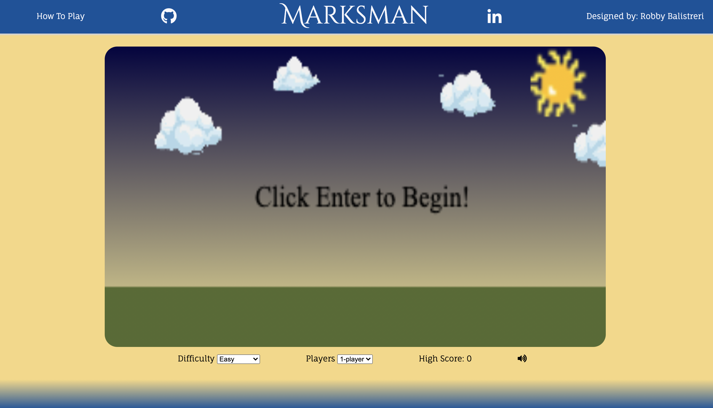
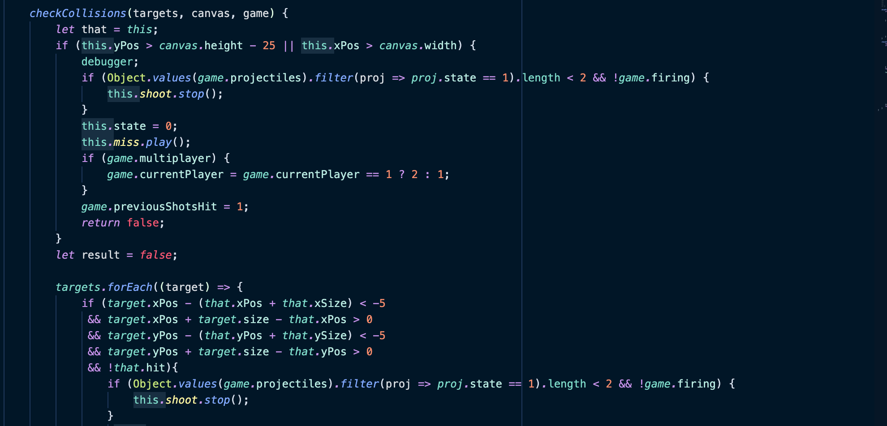
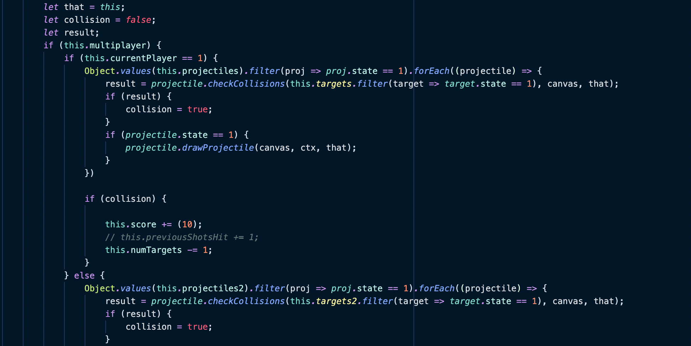

Welcome to the Marksman wiki!

## Background and Overview
As a kid I always old school 2D shooters. The physics were always fun to play with, and I loved experience of getting better and better as the game gave me more information every shot. Marksman is a spinoff of these retro games, allowing for user input to fire a cannon at targets flying across the map. The game also has adjustable difficulty levels, multiplayer, and sound effects

## Functionality and MVPs
In Marksman, users can:
* Interactively shoot at targets on the canvas
* Provide input to modify the game experience (difficulty)
* Scale play to allow for single player or multiplayer

In addition, this project includes: 
* How to play descriptions
* Audio accompanying the gameplay
* Links to external Github and Linkedin pages

## Display

## Architecture and Technology
The gameplay utilizing the HTML canvas element. All user inputs are taken into account via event listeners on the keyboard and cause the created game dynamically adjust. No backend or data is required for this project. No external libraries are utilized.

## Code Snippets

### Custom Collision Detection    
Custom collision detection equations were used to ensure in sync canvas element movement and display for the user. Both canvas elements and canvas bordering needed to be taken into account. 

### Multiplayer Scalability
Logic was added to the core gameplay file and associated objects to allow for both single player and multiplayer experienced based on a flexible user input.

